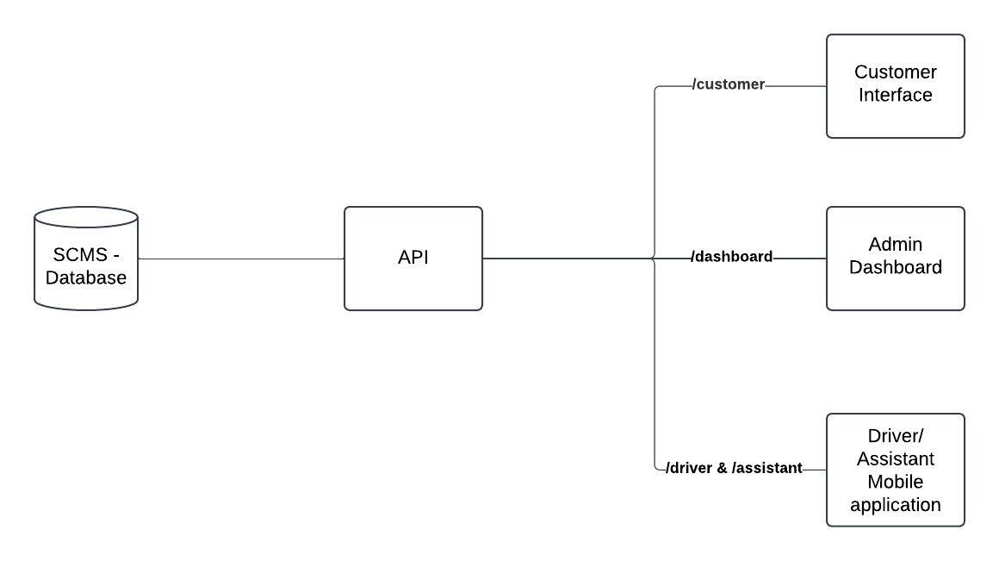
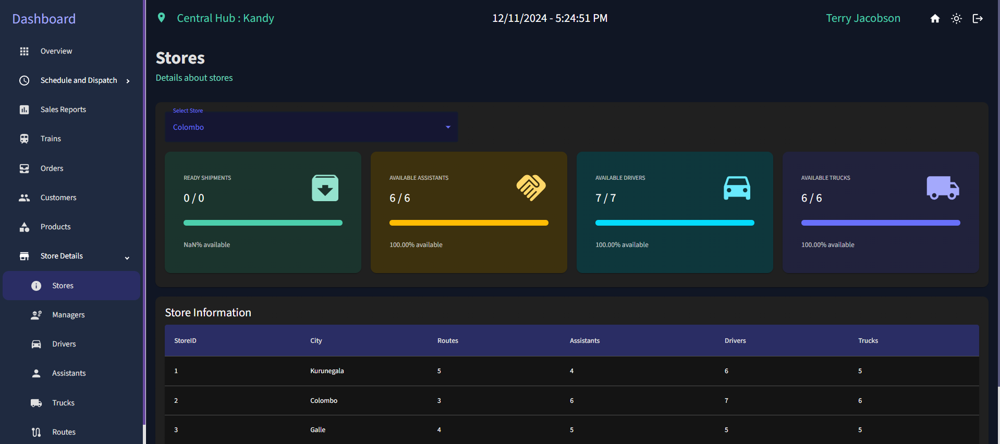

# Supply Chain Management Platform

Welcome to the **Supply Chain Management Platform**, a comprehensive solution for managing e-commerce interactions, operations, and logistics. This platform simplifies product management for customers, streamlines operations for administrators, and optimizes logistics for truck drivers.

---

## Architecture
### System Structure 

### Database Structure (ER Diagram)


---

## 🚀 Features

### E-commerce Platform for Customers
- **Product Browsing & Searching**: Easily find products by categories and keywords.
- **Seamless Ordering**: Add items to the cart and enjoy a smooth checkout process.
- **Route Selection**: Choose optimized delivery routes.
- **Responsive Interface**: Built with React, styled using Material UI and Tailwind CSS.
- **Email Notifications**: Automated emails for order updates and confirmations.

### Admin Panel
- **Order Insights**: Analyze sales, revenue, and inventory trends.
- **Performance Monitoring**: Track employee progress and store performance.
- **Intuitive Dashboard**: Real-time analytics and visualizations.
- **Inventory Management**: Update stock levels and monitor shipments.

### Mobile App for Truck Drivers
- **Shipment Management**: Drivers receive shipment details and updates.
- **Real-Time Notifications**: Stay informed about assignment and delivery status.

---

## 🛠 Technologies Used

### Backend
- **Node.js & Express**: Robust data processing and API handling.
- **SQL/NoSQL Databases**: Ensures scalable and secure data management.

### Frontend
- **React**: Powers the web interfaces.
- **Material UI** & **Tailwind CSS**: Delivers responsive and elegant designs.

### Mobile
- **Flutter**: Cross-platform app for iOS and Android.

### Additional Tools
- **Redux**: State management for complex UI.
- **EmailJS**: For email notifications.
- **Axios**: API communication.
- **React Router**: Streamlined navigation.

---

## 📷 Visual Overview

### Screenshots

#### Customer Platform
- **Login Page**

- **Product Page**

- **Cart Page**


#### Admin Panel
- **Login Page**

- **Dashboard**

- **Sales Analytics**

- **Order Management**

- **Train Status**

- **Store Details**

- **Shipment Details**


- **Platform Showcase**
- Watch the video demonstration of the platform:  
[Platform Demo](https://youtu.be/-bgOPcxjmuA)

#### Mobile App
- **Shipment Details**

- **Assignment Updates**


---

## 📦 Project Setup

1. **Clone all the Repositories**:
   ```bash
   git clone https://github.com/DBMS-CS3043-GROUP-38/repo-name.git
   ```

2. **Set Up Each Component**:
   - Follow the specific setup guides in the respective repositories for:
     - Backend (API)
     - Admin Frontend
     - Customer Frontend
     - Mobile App

3. **Run the Project**:
   - Ensure all components are running for full functionality.

---

## 🧩 Contribution Guidelines

We welcome contributions to this project.
---

## 📜 License

This project is licensed under the MIT License. See the [LICENSE](link-to-license) file for details.

